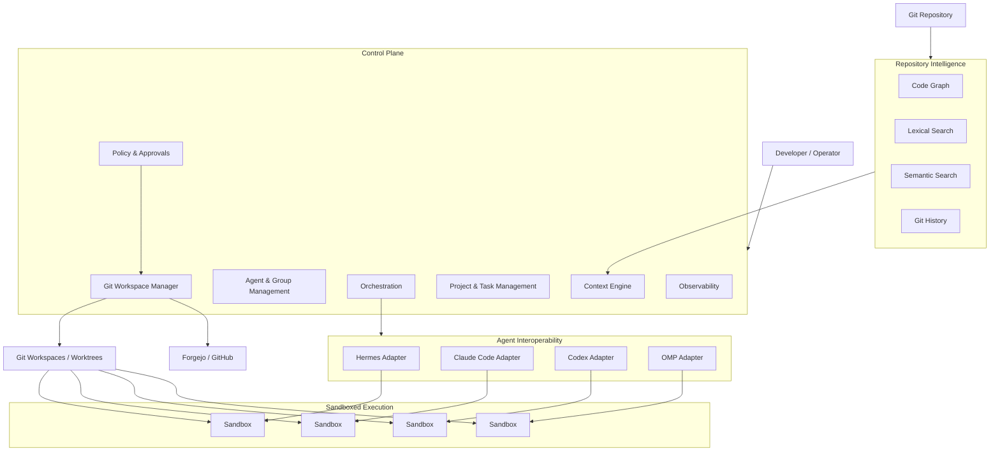

# Agnest

> **A Git-native control plane for multi-agent software engineering.**

Agnest coordinates heterogeneous AI coding agents as a software engineering team while keeping Git, execution, context, and publication under explicit control.

Bring your agents. Bring your models. Bring your repository.

Agnest gives every agent an isolated workspace, the context it actually needs, and only the authority required to do its job.

> **Give every agent the context it needs — and nothing it doesn't.**

---

## What is Agnest?

AI coding agents are becoming increasingly capable, but most still operate as isolated sessions.

Each agent typically:

- rediscovers the repository from scratch;
- consumes overlapping context;
- manages its own execution environment differently;
- has inconsistent access to Git and external tools;
- stores important decisions inside transient conversations;
- and is often given more authority than it actually needs.

Running several agents at once multiplies those problems.

Agnest treats AI agents differently:

> **Agents are engineering workers operating inside governed software delivery infrastructure, not chat sessions with repository access.**

Agnest sits above coding harnesses such as:

- Hermes
- Claude Code
- Codex
- OMP

and provides a common control plane for:

- persistent agent identity;
- isolated Git workspaces;
- sandboxed execution;
- multi-agent collaboration;
- task and artifact orchestration;
- repository intelligence;
- context-efficient retrieval;
- specialist review;
- controlled Git publication;
- security boundaries;
- and token/cost observability.

Agnest is **not another coding harness** and does not attempt to replace the agents you already use.

---

## The core idea

An agent is not its harness.

An agent is not its model.

An agent is not its sandbox.

```text
Agent
├── identity
├── role
├── capabilities
├── permissions
├── memory references
├── task history
└── group memberships

        ≠

Harness
├── Hermes
├── Claude Code
├── Codex
└── OMP

        ≠

Sandbox
├── system container
├── OCI container
├── VM
└── future providers

        ≠

Model
├── frontier cloud model
├── local model
└── inference gateway
```

The same persistent agent can therefore change harness, model, or execution environment without losing its identity in the engineering organization.

---

## Product pillars

### Agent Fabric

A harness-independent model for software engineering agents.

Agnest models concepts such as:

```text
Agent
Role
Capability
Group
Task
Artifact
Finding
Decision
Event
Approval
Runtime Binding
Runtime Session
```

Agents can collaborate in two fundamentally different ways.

**Deliberation** allows several specialists to reason about the same problem and produce a decision or artifact.

```text
Architect ──────┐
Security ───────┼──> Decision / Review Artifact
Integration ────┤
Data Design ────┘
```

**Workflow** assigns different stages of delivery to different agents.

```text
Plan
  ↓
Architecture
  ↓
Implementation
  ↓
QA
  ↓
Code Review
  ↓
Security Review
  ↓
Publish
```

Durable state lives in tasks, artifacts, findings, decisions, and Git—not only in conversation transcripts.

---

### Engineering Workspace

Agnest is Git-native and local-first.

Remote Git hosting is treated as a **collaboration and publication boundary**, not as the agent's primary workspace.

```text
Remote Repository
        │
       fetch
        ▼
   Local Mirror
        │
        ├── Workspace A
        │      └── Git worktree
        │           └── Sandbox A
        │
        ├── Workspace B
        │      └── Git worktree
        │           └── Sandbox B
        │
        └── Workspace C
               └── Git worktree
                    └── Sandbox C
```

Each task can receive:

- a pinned base commit;
- an isolated branch;
- an isolated Git worktree;
- an isolated sandbox;
- its own runtime binding;
- local commands and tests;
- reviewable changes;
- and explicit publication state.

The intended workflow is:

```text
Issue
  ↓
Create Workspace
  ↓
Create Branch + Worktree
  ↓
Attach Sandbox
  ↓
Agent Works
  ↓
Local Diff
  ↓
Tests
  ↓
Specialist Review
  ↓
Human / Policy Approval
  ↓
Commit
  ↓
Publish
  ↓
Pull Request
```

Agnest follows a simple principle:

> **Local-first, remote-by-approval.**

Agent sandboxes should not normally receive reusable Forgejo or GitHub write credentials.

---

### Context Intelligence

Large context windows are useful, but they should not become the default method for understanding a repository.

Agnest aims for:

> **minimum sufficient context**

Instead of repeatedly sending a large repository to every frontier agent, Agnest can build derived repository intelligence from:

```text
AST / symbols
      +
code relationships
      +
lexical search
      +
semantic retrieval
      +
Git history
      +
issues
      +
documentation
      +
workspace changes
```

A context engine can then assemble role-specific evidence.

For the same issue:

```text
Implementer
├── relevant implementation symbols
├── source files
├── tests
└── API contracts

Security Reviewer
├── trust boundaries
├── security-sensitive symbols
├── authentication flows
└── actual diff

QA
├── affected behavior
├── tests
├── edge cases
└── changed dependencies

Code Reviewer
├── actual diff
├── callers
├── related modules
└── repository conventions
```

The source repository remains canonical.

Graphs, embeddings, summaries, and indexes are always **derived intelligence**.

```text
Derived intelligence
        ↓
Find likely evidence
        ↓
Retrieve actual source
        ↓
Reason against source
```

Agnest does not treat a graph or embedding as proof of what the code actually does.

---

### Governed Delivery

Autonomous execution should not imply unlimited authority.

Agnest separates authority across boundaries such as:

```text
Control Plane
Git Workspace Service
Credentialed Fetch Broker
Sandbox Provider Broker
Execution Gateway
Task Sandbox
```

A task sandbox may be allowed to:

```text
read workspace      ✓
modify workspace    ✓
run commands        ✓
run tests           ✓
```

while being denied:

```text
read Git credentials        ✕
write remote repository     ✕
access provider daemon      ✕
read sibling workspaces     ✕
access control-plane state  ✕
```

Publication remains a protected transition.

---

## High-level architecture



The architecture intentionally keeps replaceable technologies behind product boundaries.

For example:

```text
Graphify        → possible repository graph implementation
Neo4j           → possible graph/retrieval backend
9Router         → possible inference gateway
Incus           → MVP1 sandbox provider
Forgejo/GitHub  → remote Git providers
```

These tools are implementation choices, not the definition of Agnest itself.

---

## Design principles

Agnest is built around the following principles.

### Harness agnostic

```text
Agent != Harness
```

Hermes, Claude Code, Codex, and OMP are the initial runtime focus, but the domain model must not depend on any one harness.

### Sandbox agnostic

```text
Agent != Sandbox
```

Execution providers implement a common capability-driven sandbox contract.

MVP1 currently targets **local Incus**.

### Model agnostic

```text
Agent != Model
```

Models may be selected based on role, task, capability, cost, policy, availability, or quota.

### Git native

Branches, commits, worktrees, diffs, staging, publication, pull requests, and Git provenance are first-class concepts.

### A2A native

A2A semantics are the intended common interoperability model between agents and the control plane.

Harnesses that do not expose A2A natively can be wrapped by runtime adapters.

### Artifact driven

Important state is stored as typed artifacts rather than being recoverable only from conversations.

### Context efficient

Repository context is selected intentionally and measured.

### Source verified

Derived intelligence helps locate evidence.

Source code remains truth.

### Local-first, remote-by-approval

Agents work locally before anything crosses the remote Git boundary.

### Human override always exists

A human operator can inspect, pause, reject, retry, reassign, revert, or stop protected actions.

---

## Repository intelligence and token efficiency

One of Agnest's long-term goals is reducing the cost of frontier-model software engineering without reducing engineering quality.

Instead of:

```text
Agent A → explore entire repo
Agent B → explore entire repo
Agent C → explore entire repo
Agent D → explore entire repo
```

Agnest aims for:

```text
                  Repository
                      │
                      ▼
            Shared Intelligence
                      │
        ┌─────────────┼─────────────┐
        ▼             ▼             ▼
      Graph        Lexical       Semantic
        │             │             │
        └─────────────┼─────────────┘
                      ▼
                Context Engine
                      │
        ┌─────────────┼─────────────┐
        ▼             ▼             ▼
   Implementer    Reviewer       Security
   context        context        context
```

Context efficiency should eventually be visible as a product metric:

```text
Repository size          4,800,000 tokens

Potentially relevant       140,000
Retrieved                    28,000
Selected                     16,000
Sent to frontier model       11,000

Avoided repository context    99%+
```

Token saving is not considered successful if engineering quality decreases.

Agnest therefore intends to correlate context decisions with outcomes such as:

- tests;
- review findings;
- task success;
- rework;
- regressions;
- and benchmark results.

---

## Runtime targets

The initial runtime focus is:

| Harness | Direction |
|---|---|
| Hermes | Planned runtime adapter |
| Claude Code | Planned runtime adapter |
| Codex | Planned runtime adapter |
| OMP | Planned runtime adapter |

Agnest intends to normalize runtime capabilities rather than pretend every harness behaves identically.

Runtime-specific behavior remains behind an adapter boundary.

---

## Git integrations

Initial remote Git targets:

| Provider | Direction |
|---|---|
| Forgejo | Planned |
| GitHub | Planned |

Remote Git credentials belong to a controlled integration boundary rather than agent sandboxes.

The long-term publication flow is:

```text
Local Change
    ↓
Review
    ↓
Quality Gate
    ↓
Approval
    ↓
Commit
    ↓
Publish Request
    ↓
Remote Branch
    ↓
Pull Request
```

---

## Sandbox execution

MVP1 targets **local Incus** behind a provider abstraction.

The required baseline is an Incus system container.

OCI application containers and Incus VMs are capability-gated modes rather than assumed capabilities.

The provider model is intentionally designed so additional implementations can be introduced later without redefining core product concepts.

Possible future providers include:

```text
Docker
Incus / LXC
VM platforms
Kubernetes
remote execution hosts
```

---

## Roadmap

Agnest is designed as a sequence of capability milestones.

### MVP1 — Git Foundation & Sandboxed Workspaces

Foundation for:

- repository registration;
- remote metadata;
- local repository mirrors;
- isolated workspaces;
- branches and worktrees;
- sandbox lifecycle;
- local command execution;
- test execution;
- diff/status operations;
- authority boundaries;
- recovery and reconciliation.

### MVP2 — Agent Runtime Fabric

Adds:

- persistent agent identities;
- roles and capabilities;
- runtime adapters;
- runtime bindings;
- runtime sessions;
- Hermes support;
- Claude Code support;
- Codex support;
- OMP support;
- normalized runtime events;
- model execution metadata.

### MVP3 — Multi-Agent Orchestration & Groups

Adds:

- tasks;
- task dependencies;
- assignments;
- groups;
- deliberation mode;
- workflow mode;
- artifacts;
- findings;
- decisions;
- approvals;
- handoffs;
- retries;
- typed events.

### MVP4 — Review, Quality Gates & Controlled Publish

Adds:

- QA review;
- code review;
- security review;
- inline findings;
- review anchors;
- quality gates;
- local commit workflow;
- publish approval;
- remote branch publication;
- pull request creation;
- CI status;
- risk acceptance.

### MVP5 — Repository Intelligence

Adds:

- AST and symbol indexing;
- code relationships;
- lexical search;
- semantic indexing;
- Git history intelligence;
- test associations;
- documentation relationships;
- workspace index overlays;
- retrieval APIs.

### MVP6 — Context Intelligence & Token Economics

Adds:

- context requests;
- retrieval planning;
- role-aware context profiles;
- hybrid retrieval;
- candidate fusion;
- reranking;
- source verification;
- context packs;
- adaptive context escalation;
- token budgeting;
- token telemetry;
- cost telemetry;
- quality correlation;
- context-efficiency benchmarks.

### MVP7 — Integrations & Inference Fabric

Adds:

- integration registry;
- MCP servers and tools;
- tool policy;
- inference providers;
- model policy;
- routing;
- fallback;
- local models;
- optional gateways such as 9Router or LiteLLM;
- provider capability discovery.

### MVP8 — Governance & Scale

Adds:

- multi-project governance;
- tenant boundaries;
- RBAC;
- policy enforcement;
- secret governance;
- audit;
- retention;
- organizational controls;
- broader deployment models;
- enterprise-scale operations.

Detailed requirements live in [`docs/product/`](docs/product/).

---

## Documentation

Agnest is currently design-first.

The repository intentionally keeps product, architecture, integration, security, and data design as separate but traceable disciplines.

```text
docs/
├── agents/
│   ├── roles.md
│   └── id-registry.md
│
├── architecture/
│   ├── boundaries-M<n>.md
│   ├── invariants-M<n>.md
│   └── sequences-M<n>.md
│
├── data/
│   ├── entity-register.md
│   ├── event-register.md
│   └── ...
│
├── decisions/
│   ├── ADR-0000-template.md
│   └── ADR-*.md
│
├── integration/
│   ├── contracts/
│   ├── conformance/
│   └── capability-matrix-M<n>.md
│
├── product/
│   ├── 01-product-vision.md
│   ├── 02-prd-mvp1-git-foundation.md
│   ├── 03-prd-mvp2-agent-runtime-fabric.md
│   ├── ...
│   └── 10-traceability-matrix.md
│
├── security/
│   └── ...
│
└── glossary.md
```

Start here:

- [Product Vision](docs/product/01-product-vision.md)
- [MVP1 PRD — Git Foundation & Sandboxed Workspaces](docs/product/02-prd-mvp1-git-foundation.md)
- [Agent Roles and Working Agreements](docs/agents/roles.md)
- [Architecture](docs/architecture/README.md)
- [Integration](docs/integration/README.md)
- [Data Design](docs/data/README.md)
- [Decision Records](docs/decisions/README.md)
- [Glossary](docs/glossary.md)

---

## Agnest builds Agnest

The project deliberately applies many of its own product principles to its development process.

Design work is split across specialist roles:

| Role | Responsibility |
|---|---|
| Product Owner | scope, priorities, protected decisions |
| Architecture | boundaries, APIs, lifecycle, failure domains |
| Security | trust boundaries, threats, isolation, policy |
| Integration | harnesses, Git, sandbox and external contracts |
| Data Design | entities, state machines, events, lineage |

Design uses **deliberation**.

Implementation uses **workflow**.

Important decisions become ADRs.

Requirements, controls, entities, architecture components, threats, integration contracts, and decisions receive traceable identifiers.

The goal is simple:

> If Agnest eventually expects engineering agents to work this way, the Agnest project should prove that the workflow works.

---

## Current status

> **Agnest is currently in active design and early development.**

The product architecture and MVP roadmap are being defined before broad implementation begins.

MVP1 design currently focuses on:

```text
Git foundation
local workspaces
Incus sandboxing
authority separation
safe command execution
recovery semantics
integration contracts
data models
security boundaries
```

The repository should currently be considered **experimental and not production-ready**.

Interfaces, terminology, and architecture may still change while foundational decisions are being validated.

---

## What Agnest is not

Agnest is not intended to be:

- another foundation model;
- another Claude Code/Codex replacement;
- a generic chatbot framework;
- a system where every agent receives the entire repository;
- a shared shell where every agent has the same privileges;
- an autonomous system that bypasses Git review;
- or a wrapper that hard-depends on one retrieval, model, or sandbox vendor.

The purpose of Agnest is to coordinate existing and future engineering agents inside a safer, more efficient, and more observable software delivery system.

---

## Project philosophy

Agnest borrows good ideas shamelessly—but intentionally.

The project learns from systems such as coding-agent runtimes, multi-agent orchestrators, Git-native developer tools, sandbox platforms, agent interoperability protocols, and repository-intelligence systems.

Patterns that fit the product vision are adopted.

Patterns that do not are left behind.

The goal is not novelty for its own sake.

The goal is a coherent engineering system.

---

## Contributing

Agnest is still establishing its foundational architecture.

Before proposing implementation changes, please read:

1. [`docs/product/01-product-vision.md`](docs/product/01-product-vision.md)
2. [`docs/agents/roles.md`](docs/agents/roles.md)
3. [`docs/glossary.md`](docs/glossary.md)
4. the relevant MVP PRD;
5. existing ADRs and discipline-specific design documents.

Design decisions should begin with an issue and end as durable repository artifacts rather than disappearing into chat history.

Contribution guidelines will become more detailed as the implementation stabilizes.

---

## License

Licensing is not yet finalized.

Do not assume a license until a license file is explicitly added to this repository.

---

<p align="center">
  <strong>Agnest</strong><br>
  Give every agent the context it needs — and nothing it doesn't.
</p>
