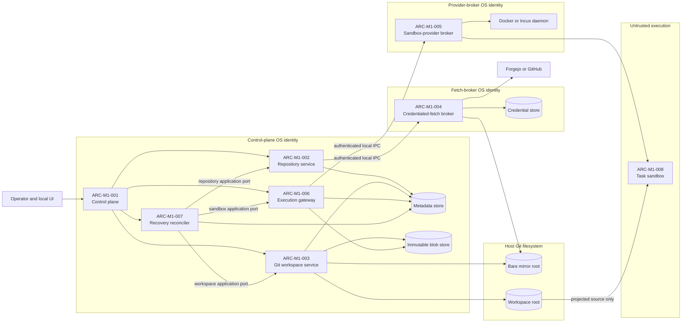

# MVP1 architecture boundaries

**Status:** Proposed  
**Owner:** Architecture (Codex)  
**Issue:** #7  
**Decision:** `ADR-0003`  
**Requirements:** `FR-M1-002`, `FR-M1-003`, `FR-M1-005`, `FR-M1-006`,
`FR-M1-010`, `FR-M1-017`, `FR-M1-018`, `FR-M1-019`

## Purpose and scope

This document turns the authority decision in `ADR-0003` into a component map that an
implementer can follow. It fixes ownership, allowed dependencies, and failure behavior;
it does not choose database tables, HTTP payloads, container hardening profiles, or
provider-specific error codes.

MVP1 is a modular monolith surrounded by three enforceable authority boundaries: the
task sandbox, the credentialed-fetch broker, and the sandbox-provider broker. A boundary
is a process and OS-identity boundary only where crossing it changes what a compromise
can do.

## System context and trust zones

Arrows are allowed calls or data access, not transitive authority. In particular, the
control plane can request typed broker operations but cannot obtain the broker's
credential or daemon handle.

## Component catalogue

### `ARC-M1-001` — MVP1 modular control plane

**Responsibility.** Authenticate the local operator, validate intent, coordinate use
cases, enforce lifecycle guards, and expose current state. It constructs each module
with least-authority ports rather than a shared container holding every adapter.

**Inbound.** Local UI/API requests and startup lifecycle.

**Outbound dependencies.** `ARC-M1-002`, `ARC-M1-003`, `ARC-M1-006`, and
`ARC-M1-007`; the relational metadata store through restricted repositories.

**Authority.** Application metadata and policy. It has typed broker clients but no Git
credential, provider daemon socket, or provider credential. The metadata and immutable
blob roots are inside this OS-identity trust zone, but scoped adapters restrict blob
write/read calls to the Git Workspace and Execution modules plus authorized operator
retrieval paths. Task sandboxes never receive the blob root.

**Failure behavior.** Reject invalid or stale requests without external effect. Once an
external-operation intent is committed, return an operation reference even if the
outcome becomes unknown; never claim success from an in-memory result alone.

### `ARC-M1-002` — Repository service

**Responsibility.** Register Repository and Repository Remote metadata, serialize mirror
mutation per Repository, request authenticated fetch, and expose fetched commit/ref
observations without moving active Workspace bases.

**Inbound.** Repository registration, refresh, and base-resolution use cases.

**Outbound dependencies.** Metadata repositories, `ARC-M1-004`, and read-only mirror
inspection through a Git adapter.

**Authority.** Repository intent and metadata. It may identify an integration and remote
but cannot read its credential value.

**Failure behavior.** Preserve the last confirmed fetch state and record the new fetch
intent as failed or unknown. A failed fetch does not mutate an existing Workspace or its
pinned base SHA.

### `ARC-M1-003` — Git workspace service

**Responsibility.** Create and inspect linked worktrees, own Workspace paths, and perform
status, diff, stage, unstage, restore, quarantine, discard, and archive operations.

**Inbound.** Typed Workspace operations from application use cases and reconciler.

**Outbound dependencies.** Metadata repositories, bare mirror/object store, Workspace
root, and immutable blob adapter for large diffs where needed.

**Authority.** Host-side local Git state for one Workspace at a time. Git mutation is
serialized per Workspace; mirror mutation remains owned by `ARC-M1-002`.

**Failure behavior.** Re-resolve real paths at use time. An unavailable filesystem is
`UNOBSERVABLE`, not absence. An unowned worktree is quarantined, never automatically
deleted. A partial mutation remains discoverable through its committed intent.

### `ARC-M1-004` — Credentialed-fetch broker

**Responsibility.** Select a short-lived fetch credential by registered canonical origin
and execute sanitized Git fetch into the configured bare mirror.

**Inbound.** Authenticated local IPC carrying repository identity, expected remote
origin, mirror identity, and operation ID—not a credential value.

**Outbound dependencies.** Credential store, configured mirror root, and registered
remote Git host.

**Authority.** Fetch-only credential plus mirror-write access. It has no access to
Workspace roots, provider daemon, or application database.

**Failure behavior.** Reject scheme/origin/user-info mismatch before network access;
reject cross-origin redirects; report typed outcome and evidence. Never return or persist
a reusable credential outside its custody.

### `ARC-M1-005` — Sandbox-provider broker

**Responsibility.** Resolve a trusted profile and perform provider lifecycle operations
against Docker, Incus/LXC, or a future VM adapter. It materializes product ownership and
operation identity as labels or deterministic provider names.

**Inbound.** Authenticated local IPC carrying product identities, generation,
deployment ID, operation ID, and server-owned profile name. MVP1 typed `exec` also
carries bounded argv, allowlisted environment, approved working directory, timeout,
output limit, and cancellation identity.

**Outbound dependencies.** Provider daemon/API, trusted profile catalogue, and its
broker-owned resource map.

**Authority.** Provider-daemon authority. It never receives Git credentials, arbitrary
container specifications, or application-database access.

**Failure behavior.** Unknown capability means unsupported. Retries observe by ownership
labels before create. A stale `(sandbox_uuid, generation)` is rejected, never retargeted.
Ambiguous daemon outcomes are returned as `UNKNOWN_OUTCOME` for reconciliation.

Ownership and operation identity must be established atomically in the provider create
call, using labels in the create specification or a deterministic provider name. A
provider unable to guarantee this declares the capability unsupported; the corresponding
profile is ineligible.

### `ARC-M1-006` — Execution gateway

**Responsibility.** Present the control plane's sandbox application port for interactive
and recovery lifecycle calls. For execution, validate a Command Run or Test Run, bind it
to an existing sandbox lease, dispatch typed `exec`, bound and persist output, handle
timeout/cancellation, and mark results with their Workspace revision and environment
conditions.

**Inbound.** Operator-requested command/test execution in MVP1.

**Outbound dependencies.** Metadata and blob repositories plus `ARC-M1-005`.

**Authority.** Command policy and audit metadata, not confinement construction or daemon
authority.

**Failure behavior.** Reject stale leases or working directories outside the Workspace.
Probe Git metadata at sandbox start; attach `GitMetadataUnavailable` to every affected
result even when the command exits zero. Truncated output is explicit, never silent.
After dispatch, an ambiguous execution is never retried automatically: the same command
may still be running and is not idempotent merely because it has an `operation_id`.

### `ARC-M1-007` — Recovery reconciler

**Responsibility.** Compare committed intent with provider and filesystem observations,
then retry, compensate, quarantine, fail, or request operator resolution through the same
ports used by interactive operations.

**Inbound.** Startup, scheduled reconciliation, and explicit operator retry.

**Outbound dependencies.** Metadata repositories and the application ports of
`ARC-M1-002`, `ARC-M1-003`, and `ARC-M1-006`. Those owners reach brokers through their
normal typed ports; the reconciler does not call a broker around them.

**Authority.** Recovery coordination. It cannot bypass lifecycle guards or delete a
foreign/unattributed resource.

**Failure behavior.** Persist observations and resume later. Destruction requires
ownership, positively available authorities, minimum age, and a durable count of
distinct successful observations. Worktrees with unpublished data are quarantined.

### `ARC-M1-008` — Task sandbox boundary

**Responsibility.** Run commands against the assigned Workspace projection within the
selected provider profile.

**Inbound.** Workspace projection, approved ephemeral paths, bounded execution requests,
and profile-approved network access.

**Outbound dependencies.** Only destinations allowed by the profile. It has no control
plane or broker dependency.

**Authority.** Write access to projected Workspace source and declared ephemeral paths.

**Failure behavior.** Its crash or compromise is contained to the assigned projection
and approved network surface. It cannot see the bare mirror, linked-worktree `.git`,
sibling workspaces, broker IPC, daemon endpoints, control-plane state, or Git credentials.

## Canonical state ownership

| Fact | Owner | Consumers | Invalidated or re-observed when |
|---|---|---|---|
| Commit graph, refs, base SHA | Git mirror | Repository and Workspace services | A successful fetch changes mirror refs; pinned Workspace base remains unchanged |
| Working files and index | Workspace Git filesystem | Git Workspace Service | Any filesystem or Git mutation changes Workspace revision |
| Product identity, intent, lifecycle, correlation | Relational metadata store | All control-plane modules | Only through the structurally enforced transactional write path |
| Deployment ownership identity | Relational metadata store | Provider broker and reconciler | Explicit operator recovery only; never regenerated on restart or upgrade |
| Provider resource presence | Current provider observation | Broker and reconciler | Every lifecycle request and reconciliation pass |
| Filesystem resource presence | Current filesystem observation | Git Workspace Service and reconciler | Every relevant operation; unmounted root is `UNOBSERVABLE` |
| Command logs and large diffs | Immutable blob store | Execution and review paths | Never mutated; superseded by a new referenced blob |

Paths and provider IDs are locators, not product identity. Cached status, diff, test, or
command data records the Workspace revision it describes and becomes stale when the
revision changes.

## Deployment constraints

MVP1 may run all components on one trusted machine, but not under one authority:

- the control plane, fetch broker, and provider broker use separate OS identities;
- local IPC authenticates peers and is inaccessible from task sandboxes;
- mirror, Workspace, credential, broker-runtime, and metadata roots are separate;
- the immutable blob root remains inside the control-plane trust zone and is not mounted
  into task sandboxes; raw output is treated as potentially secret-bearing;
- only the fetch broker combines remote credential and mirror-write access;
- only the provider broker combines profile catalogue and daemon access;
- a task sandbox receives neither combination.

`deployment_id` is generated once for an Agnest deployment and persisted in the metadata
store. It remains stable across process restart and software upgrade. Losing it blocks
automatic ownership decisions and starts an explicit operator-recovery procedure; the
system never silently creates a replacement ID or relabels existing resources.

Remote broker placement, Kubernetes, and distributed scheduling require later ADRs. A
future transport must preserve the same authority and authenticated-caller properties;
“transport-neutral” does not mean “unauthenticated network service.”

## Follow-on contract boundaries

Integration work defines, without changing these boundaries:

1. repository connection and canonical-origin validation;
2. credentialed-fetch broker request, result, health, timeout, and error taxonomy;
3. sandbox-provider broker lifecycle, capability discovery, typed `exec`, health, and
   error normalization;
4. Workspace projection behavior per provider;
5. provider ownership-label and observation conformance tests.

Security defines threats and controls at every trust-zone crossing. Data Design defines
the exact entities, constraints, transitions, retention, and observation schema implied
by these components.
