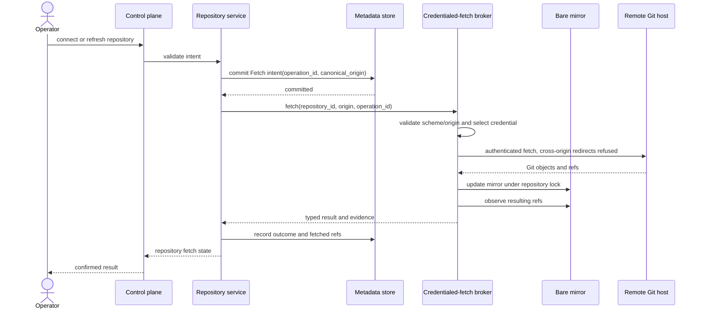
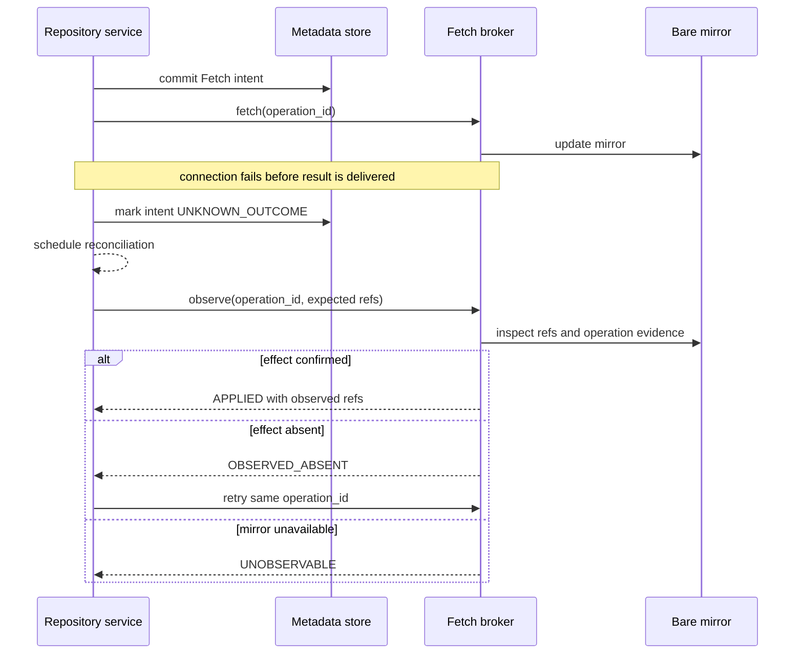
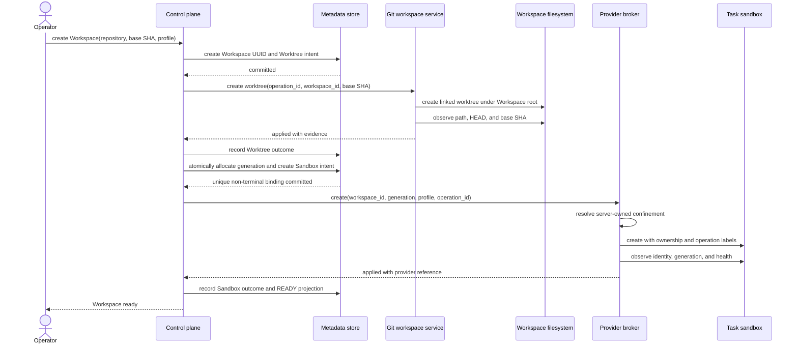
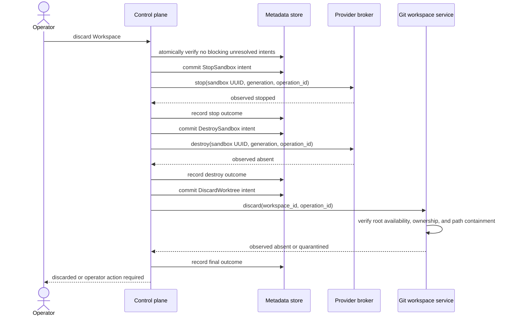

# MVP1 architecture sequences

**Status:** Proposed  
**Owner:** Architecture (Codex)  
**Issue:** #7  
**Decision:** `ADR-0003`

These sequences show ownership and durable ordering. Method names and payload shapes are
illustrative; Integration owns the eventual contracts.

## Connect or refresh a Repository



An active Workspace base never follows the mirror's updated ref. Creating another
Workspace resolves a new base explicitly.

### Ambiguous fetch outcome



## Create a Workspace and Sandbox



If a concurrent user action and reconciler both request a replacement, the database
constraint admits only one non-terminal binding. The losing transaction creates no
provider resource.

### Crash windows during create

```mermaid
stateDiagram-v2
    [*] --> IntentCommitted
    IntentCommitted --> EffectAbsent: crash before external call
    IntentCommitted --> EffectUnknown: call started; no durable result
    IntentCommitted --> OutcomeRecorded: applied result recorded
    EffectAbsent --> Retried: positive absence observed
    EffectUnknown --> OutcomeRecorded: ownership label confirms effect
    EffectUnknown --> Retried: positive absence observed
    EffectUnknown --> Wait: provider or filesystem UNOBSERVABLE
    Retried --> OutcomeRecorded: same operation converges
    Wait --> EffectUnknown: next reconciliation pass
    OutcomeRecorded --> [*]
```



The state diagram is for an external-operation intent, not `WorkspaceState`.

## Execute a Command or Test

```mermaid
sequenceDiagram
    actor O as Operator
    participant E as Execution gateway
    participant D as Metadata store
    participant P as Provider broker
    participant S as Task sandbox
    participant B as Blob store

    O->>E: run(argv, cwd, timeout, output limit)
    E->>D: read active sandbox UUID, generation, Workspace revision
    E->>E: validate cwd and execution policy
    E->>D: commit Execution intent
    E->>P: exec(sandbox UUID, generation, bounded request)
    P->>P: reject stale generation; revalidate cwd
    P->>S: execute inside existing confinement
    S-->>P: stdout, stderr, exit, timestamps
    P-->>E: bounded result or typed failure
    E->>B: write immutable large output
    E->>D: atomically record outcome, blob refs, revision, conditions
    E-->>O: result with GitMetadataUnavailable when applicable
```

Timeout and cancellation produce explicit outcomes. A connection loss after dispatch is
`UNKNOWN_OUTCOME`; the system does not blindly retarget or replay a possibly mutating
command against a replacement generation.

## Stop, discard, or archive



Archive replaces discard's final deletion with a retained Workspace and immutable
artifact references. A worktree that lacks matching metadata is never deleted by this
flow; reconciliation quarantines it.

## Startup reconciliation

```mermaid
sequenceDiagram
    participant C as Control plane
    participant D as Metadata store
    participant R as Reconciler
    participant W as Git workspace service
    participant P as Provider broker

    C->>R: start reconciliation pass(deployment_id)
    R->>D: load unresolved intents and expected resources
    par observe filesystem
        R->>W: observe expected and owned worktrees
        W-->>R: PRESENT, ABSENT, or UNOBSERVABLE with evidence
    and observe provider
        R->>P: observe resources by deployment/workspace/generation labels
        P-->>R: PRESENT, ABSENT, or UNOBSERVABLE with evidence
    end
    R->>D: persist attributed observations and counts
    loop each discrepancy
        alt safe retry of committed intent
            R->>R: invoke same application port and operation_id
        else owned provider orphan
            R->>R: stop or quarantine
            Note over R,D: destroy only after age and observation thresholds
        else unowned worktree
            R->>W: quarantine; preserve unpublished files
        else foreign or inconclusive
            R->>D: block mutation and request operator resolution
        end
    end
```

The observation count is persisted and may advance across ordinary reconciliation
passes. A restart neither resets it nor counts as evidence by itself.

## Failure ownership summary

| Failure | Immediate owner | Durable result | Recovery owner |
|---|---|---|---|
| Remote authentication or origin rejection | Fetch broker | Typed failed Fetch intent | Repository service/operator |
| Mirror write interrupted | Fetch broker | `UNKNOWN_OUTCOME` plus mirror observation | Reconciler through Repository port |
| Worktree create interrupted | Git workspace service | Intent plus filesystem observation | Reconciler through Workspace port |
| Provider create response lost | Provider broker | Intent plus provider labels/observation | Reconciler through Provider port |
| Sandbox crashes | Provider broker observes; control plane owns lifecycle | Sandbox condition and operation history | Reconciler/operator |
| Command transport lost | Execution gateway | `UNKNOWN_OUTCOME`; no automatic retarget | Operator/reconciler |
| Metadata store unavailable | Control plane | No uncommitted external action may begin | Retry after store health returns |
| Workspace root unavailable | Git workspace service | `UNOBSERVABLE`, never inferred absent | Reconciler after root returns |
